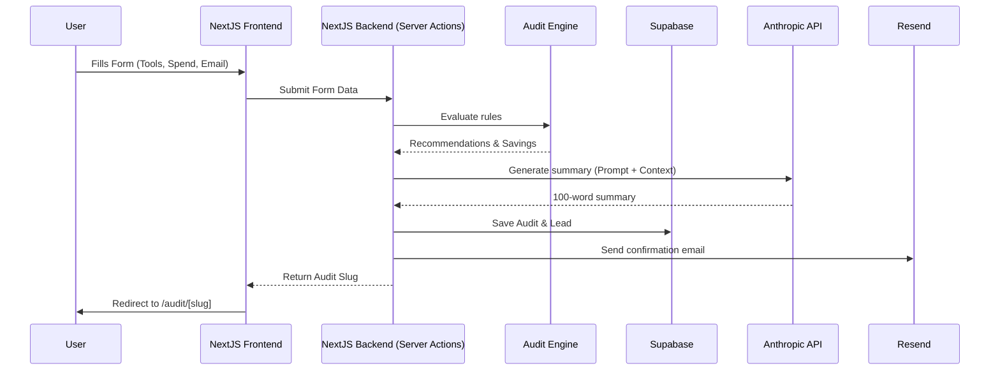

# Architecture

## Stack Justification
- **Next.js + TypeScript**: Provides React Server Components for performance, Server Actions for form handling, and strict typing for robustness.
- **Tailwind CSS + shadcn/ui**: Enables rapid, highly customizable, and aesthetically pleasing "premium" UI development without writing extensive custom CSS.
- **Supabase**: Excellent choice for BaaS. We use its PostgreSQL database to store leads and audits, and we can easily query them with strong typing via `supabase-js`.
- **Anthropic API (Claude 3.5 Sonnet)**: Selected for its high-quality nuanced text generation to create the personalized summary. It's cost-effective for a ~100 word generation.
- **Resend**: Transactional email API built for developers, simple to integrate and perfect for the confirmation emails.
- **Vercel**: Seamless integration with Next.js for deployment, providing Edge caching and fast CI/CD out of the box.

## Data Flow

## Scaling Notes
- The hardcoded audit engine runs synchronously on the server and is extremely fast.
- The Anthropic API call is the slowest part of the process. If traffic spikes, this should be moved to a background job or cached effectively.
- Supabase connection pooling should be utilized via `pgbouncer` if Vercel serverless functions scale up heavily.
