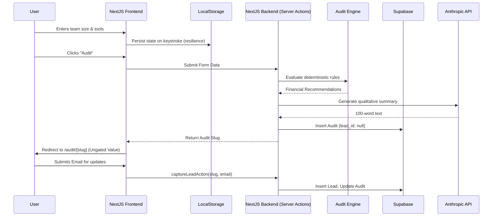

# Architecture

## Stack Justification
- **Next.js + TypeScript (App Router)**: The architecture relies heavily on React Server Components and Server Actions. We don't need a separate Express backend; we can validate inputs, call the Anthropic API, and write to Supabase entirely within `actions.ts`. This reduces network waterfall and infrastructure complexity.
- **Tailwind CSS + shadcn/ui**: We need a "premium, finance-literate" aesthetic. shadcn provides accessible, unstyled primitives that we styled with sharp borders, subtle gradients, and clean typography. It prevents the app from looking like a cheap Bootstrap template.
- **Supabase**: Selected for rapid schema iteration and its serverless-friendly connection pooling (`pgbouncer`). We split `audits` and `leads` to allow un-gated audits (no lead ID) that can be claimed later.
- **Anthropic API (Claude 3.5 Sonnet)**: Selected over OpenAI for the qualitative summary. Claude 3.5 Sonnet is exceptionally good at adopting a specific, nuanced tone ("expert procurement consultant"). It generates the summary in <2 seconds.
- **Resend**: Transactional emails are critical for the viral loop. Resend has the lowest latency and best DX for React-based stacks.
- **Vercel**: Edge caching for the static landing page, and Serverless Functions for the Audit Engine execution.

## Data Flow & State Management

## Scaling Notes & Trade-offs
- **Deterministic Rules vs LLM parsing**: We explicitly chose *not* to use an LLM to calculate the math or determine the best plan. LLMs hallucinate numbers. A CFO will not trust an LLM's math. The Audit Engine (`src/lib/audit-engine.ts`) is a pure, deterministic TypeScript function that is unit-testable. The LLM is strictly used for the qualitative "wrapper" text.
- **State Persistence**: If Supabase goes down, the `createAuditAction` will catch the error, generate a slug, and return the payload to the frontend. The frontend uses `sessionStorage` to temporarily hold the data so the user still gets their results.
